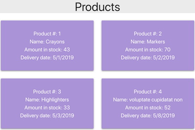

Table of Contents
=================

   * [Table of Contents](#table-of-contents)
   * [Project Overview](#project-overview)
   * [Installation](#installation)
   * [Project Description](#project-description)
      * [Screenshots](#screenshots)
   * [Attribution](#attribution)
 
# Project Overview

This project is a React app which displays details for a list of products, such as product id number, product name, amount in inventory, etc. The app will calculate the ship date of a product based on a maximum number of shipping days, and a flag indicating whether the product ships on weekends or just business days.

# Installation

This project was built using create-react-app with node version  v11.13.0 and npx version 6.7.0. The project also uses Materialize CSS (visit <https://materializecss.com> for more information.)

The app runs from a project directory named "shipping".  
Clone the repo, and execute the following:  
```bash
cd shipping
npm install
npm start
```
# Project Description
Domain: e-Commerce Shipping  
Interface: Web UI (SPA)

The React app retrieves a product list using the Fetch API from a JSON file. The fetch command can be swapped out seamlessly for a live API call.

Basic information for each product (product #, name, amount in stock) is displayed. Ship date is calculated from each product's maximum ship day setting with a start date of the current day. Products have a setting (shipOnWeekends) indicating whether they ship on weekends or not; if not, weekends are ignored, and the ship date is extended.

## Screenshots



*Observe that the ship date for product 1 is pushed out to May 1 in the first screenshot when its shipOnWeekends status is set to false.*

# Attribution
Table of contents courtesy of [gh-md-toc](https://github.com/ekalinin/github-markdown-toc) 

