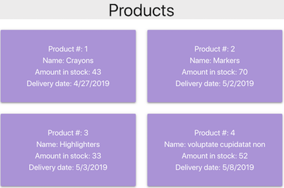

Table of Contents
=================

   * [Project Overview](#project-overview)
      * [Project Description](#project-description)
      * [Components](#components)

Created by [gh-md-toc](https://github.com/ekalinin/github-markdown-toc)
# Project Overview

This project is a React app which displays details for a list of products, such as product id number, product name, amount in inventory, etc. The app will calculate the delivery date of each product based on a maximum number of shipping days, and a flag indicating whether the product ships on weekends or just business days.

## Screenshots

Observe that the delivery date for product 1 is pushed out to May 1 in the second screenshot when its shipOnWeekends status is set to false.

## Project Description

Detailed description TBD

## Components
